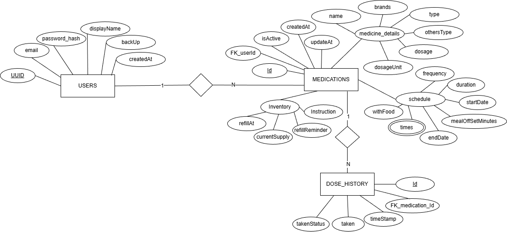

## MediTrack : Medication Tracker Offline and Online Based Applications (ProtoType)


----------------------------------------------------------------

## Project Structure



Stack and Tools for Prototype: 
- React Native/Expo (TypeScript)
- Firebase (Online Sync & Authorizations)
- AsyncStorage Expo (Offline Storage)
- Notifications Expo (Offline Notifications)

External Web (https://github.com/DelaMaharan1/medicine-reset-pass)  for Password Reset:
- Custom Next.js Page (Password Reset)
- Vercel (Deployment)
- Firebase Authorization (Backend)

This project follows a modular structure located in this directory:

- `assets/`: Static assets such as images, fonts, and icons.
- `scripts/`: Custom build and maintenance automation scripts.
- `src/app/`: Expo Router file-based pages and layout management.
- `src/components/`: Reusable UI components and feature-specific views.
- `src/constants/`: Feature-wide constants, dropdown options (e.g., duration, frequency), and theme settings.
- `src/context/`: Global state management using React Context API (Medicine, Theme, Snackbar).
- `src/hooks/`: Custom React hooks for business logic and form management.
- `src/types/`: Global TypeScript type definitions and interfaces.
- `src/utils/`: Helper functions, validation routines, data backup, and Firebase configurations.

## Get started

1. Install dependencies

   ```bash
   npm install
   ```

2. Start the app

   ```bash
   npx expo start
   ```

[... existing expo links ...]

----------------------------------------------------------------
## License & Copyright

© 2026 **Dela Surya Maharani**. All Rights Reserved.